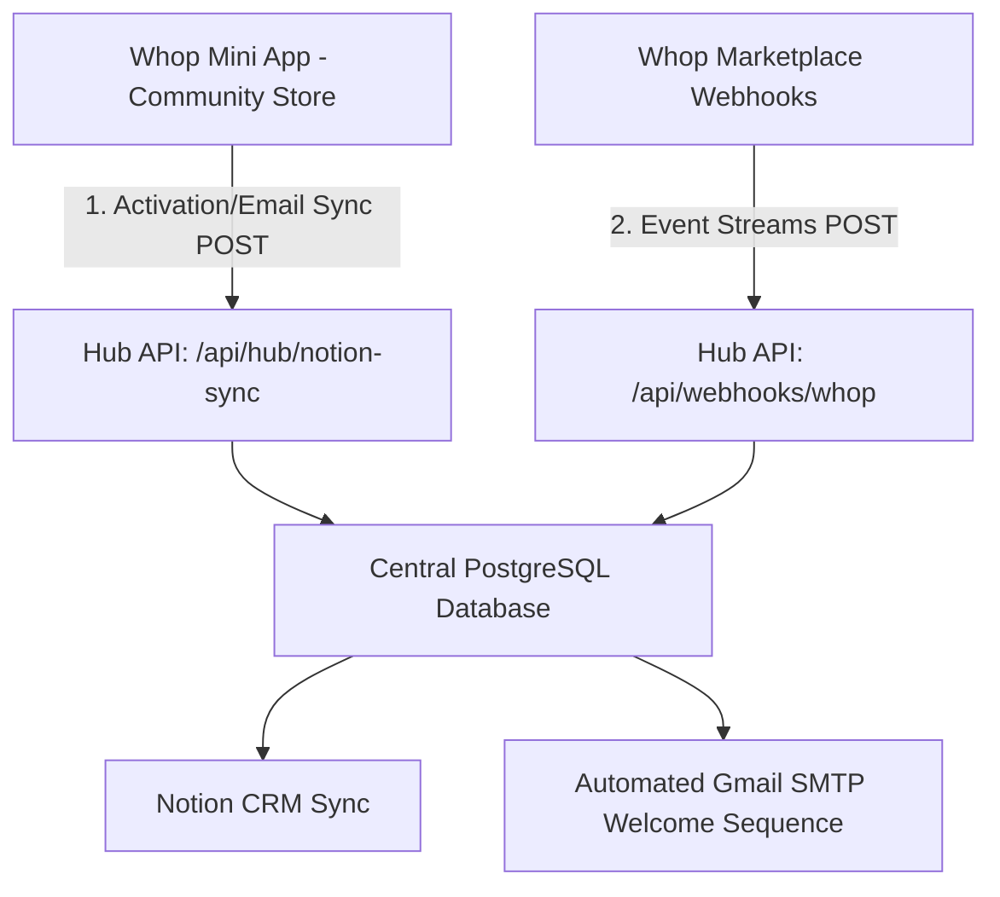

# Whop Central Hub Architecture

This document describes the architectural layout, database models, features, and licensing strategy of the **Whop Central Hub API** and its relationship to **Whop Mini Apps**.

---

## 1. Whop Nexus Architecture (Hub & Mini Apps)

The system is split into two major layers:
1. **The Central Management Hub (`hub-api`)**: A Next.js application that hosts the database (PostgreSQL via Prisma), handles user authentication (Whop OAuth), and consolidates events via webhooks.
2. **Whop Mini Apps**: Standalone features developed in separate codebases that community owners install into their Whop communities. These apps offload CRM, retention analysis, tax calculations, and marketing tracking to the Central Hub.

---

## 2. Target Features: What the Native Dashboard is Missing

The Central Hub is designed to address capabilities currently missing in the official Whop dashboard for advanced developer operations:

*   **Granular Cohort Analysis**: Long-term user retention trends, tracking groups of subscribers over custom timeframes to measure churn.
*   **Advanced Accounting & Tax Exports**: Seamless, auto-calculating tax management or tailored bookkeeping exports for global entities.
*   **Cross-App Management Panels**: A single command center for developers managing multiple Whop applications, eliminating the need to jump between separate developer app instances.
*   **Multi-Currency & Crypto Cohort Tracking**: Merging traditional credit card payment data with crypto/token-package payments to get unified developer metrics.

---

## 3. Database Schema (Prisma / PostgreSQL)

The database schema is located at [hub-api/prisma/schema.prisma](file:///Users/judeolaboboye/WMM%20Dev/hub-api/prisma/schema.prisma) and handles multi-tenant data:

*   **User**: The developer/business owner using the hub. Stores encrypted Whop OAuth tokens (`accessToken`, `refreshToken`, `tokenExpires`).
*   **WhopApp**: Individual apps registered on the Whop App Store under the developer's account.
*   **Customer**: Represents subscribers across apps, allowing groups of users to be bucketed by `joinedCohortMonth` for cohort analytics.
*   **Transaction**: Multi-currency ledger records tracking `grossAmount`, `netAmount`, and `taxAmount` for accounting and bookkeeping exports.

---

## 4. Open Source & Dual-Licensing Strategy (GPL v3)

The project is officially open-sourced under the **GNU GPL v3 License** (see [LICENSE](file:///Users/judeolaboboye/WMM%20Dev/LICENSE)).

### The Copyleft Lock & Bargaining Power
By using the **GPL v3 Copyleft License**, the codebase remains free and open for developer collaboration, while protecting the creator's IP from proprietary exploitation:
1.  **GPL v3 Enforcement**: If another developer (or Whop themselves) copies, modifies, or integrates this code into a proprietary, closed-source platform, they are legally required to open-source their entire platform code.
2.  **Dual-Licensing Strategy**: As the original creator and copyright holder, Jude Victor Olaboboye is not bound by the GPL v3 rules. Jude can sell a proprietary license or negotiate an asset sale of the codebase directly to Whop, allowing them to legally integrate the code into their native closed-source dashboard.
3.  **Forced Collaboration**: Any fork that adds improvements or bug fixes must also be open-sourced, enabling the tool to grow with the help of the developer community.
